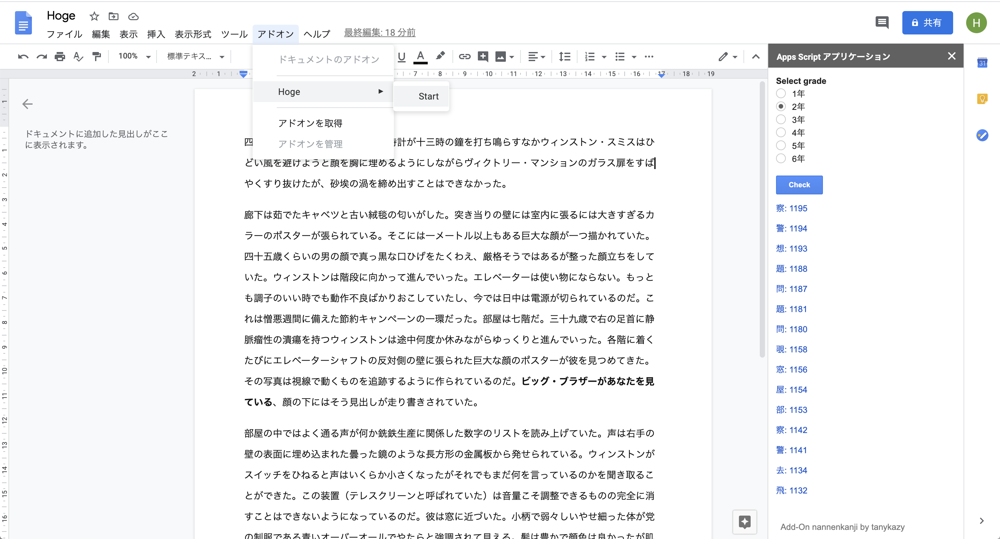

# G Suite Add-on: Nannenkanji



Nannenkanji is a G Suite Add-on to identify the grade in which you learn Chinese characters(kanji) in a document.

## Requirement

[clasp](https://github.com/google/clasp/)

## Testing

To test this Add-on, please follow the steps bellow.

```
$ clasp create Kanji xxxxxGOOGLEーDOCS-IDxxxxxxxxxxx
? Create which script? docs
Created new Google Doc: https://drive.google.com/open?id=xxxxxGOOGLEーDOCS-IDxxxxxxxxxxx
Created new Google Docs Add-on script: https://script.google.com/d/1xxxxxGOOGLEーDOCS-IDxxxxxxxxxxx/edit
Warning: files in subfolder are not accounted for unless you set a '.claspignore' file.
Cloned 1 file.
└─ appsscript.json

$ clasp push
└─ appsscript.json
└─ code.js
└─ kanji.js
└─ nannen.js
└─ sidebar.html
Pushed 5 files.

$ clasp deploy
Created version 1.
- xxxxxGOOGLEーDOCS-IDxxxxxxxxxxx @1.

$ clasp open
Opening script: https://script.google.com/d/xxxxxGOOGLEーDOCS-IDxxxxxxxxxxx/edit
```

## Author

tanykazy

## License

GPL v3
